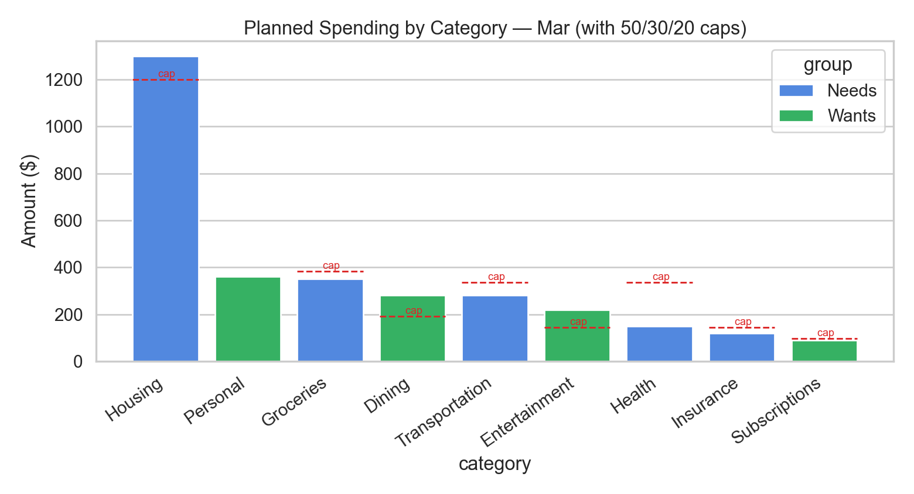
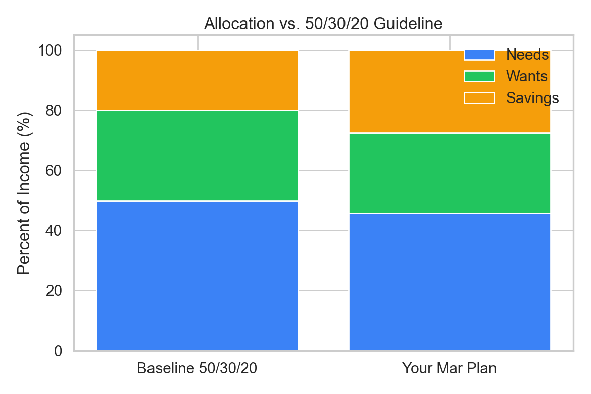
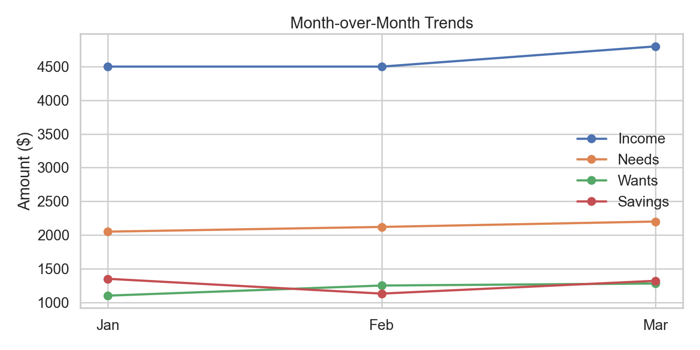
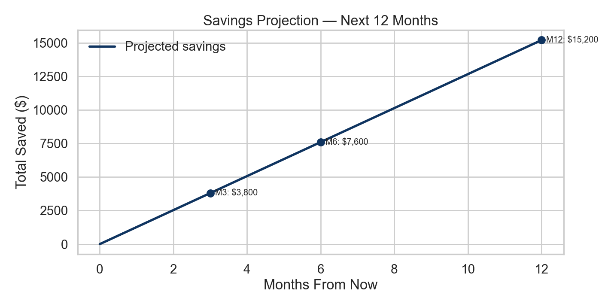
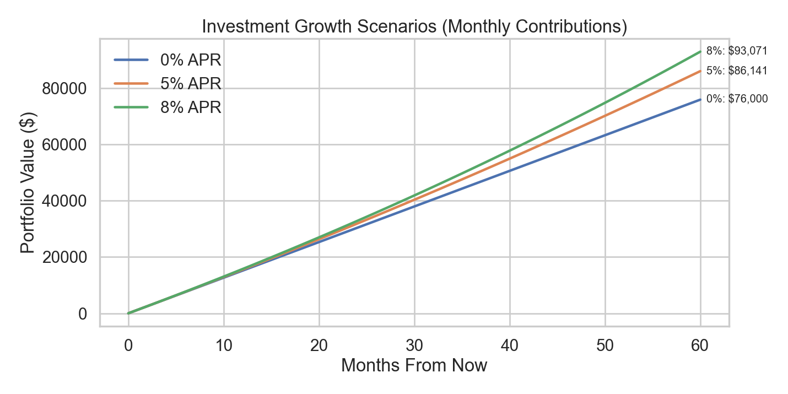
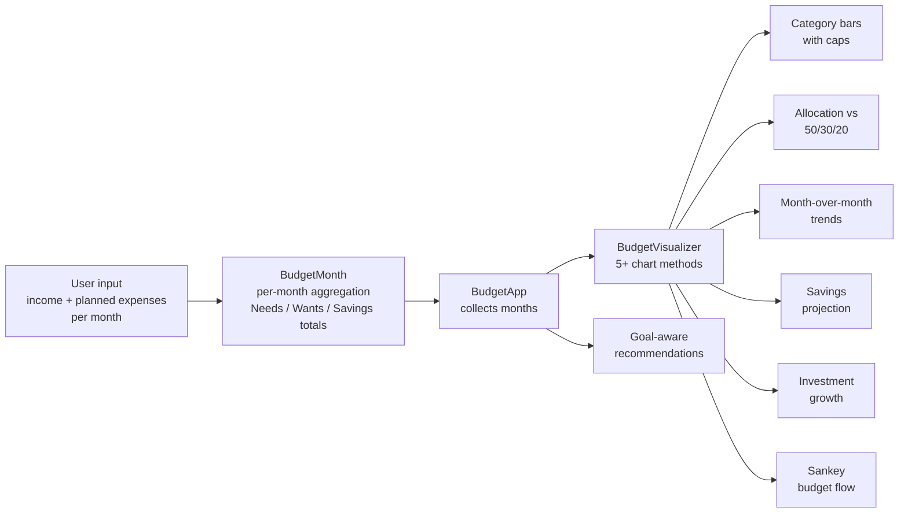

# Monthly Budget App

A multi-month personal budgeting tool written in Python. Walks you through
income and expense entry for any number of months, then renders a set of
charts to make spending patterns and savings goals visible at a glance.

Built as a personal project to practice the foundations of Python — variables,
control flow, collections, and data visualization — on a problem I actually
care about (tracking my own monthly spending while budgeting for grad school).

## Preview

Generated by [`demo_screenshots.py`](demo_screenshots.py) on a small synthetic
3-month budget. Re-run that script to refresh.



| | |
|:---:|:---:|
|  |  |
|  |  |

## Features

- **Multi-month tracking** — enter as many months as you want in one session
- **Categorized expenses** — Needs vs Wants with customizable categories
- **Cap lines on every category** — overlays the 50/30/20-derived ceiling for each spending category so you can see at a glance which are over budget
- **Goal-aware recommendations** — pick `savings`, `travel`, `debt`, or `emergency` and the app tailors its advice to that goal
- **Five chart types** — category bars, allocation comparison, month-over-month trends, savings projection, investment growth scenarios at 0% / 5% / 8% APR
- **Sankey budget flow** — total Income → Needs / Wants / Savings → individual categories, rendered with Plotly

## How It Works



The notebook is organized around three classes:

| Class | Role |
| --- | --- |
| `BudgetMonth` | One month of data — income, planned expenses by category, derived totals, ratios |
| `BudgetApp` | Collects multiple `BudgetMonth` instances, exposes summaries |
| `BudgetVisualizer` | All charts and goal-aware recommendation logic |
| `BudgetCLI` | Drives the input loop and renders charts inline as you go |

The classification of categories (Needs vs Wants) and the per-category cap
percentages are configurable at the top of the notebook — change them to match
how you actually spend rather than how the 50/30/20 rule assumes you do.

## Tech Stack

- **Python 3.10+**
- `pandas`, `numpy` — data handling
- `matplotlib`, `seaborn` — primary chart styling
- `plotly` — Sankey diagram

## Run It

```bash
pip install -r requirements.txt
jupyter notebook Monthly_Budgeting_App.ipynb
```

Then run the cells top to bottom and answer the prompts. To regenerate the
README screenshots from synthetic data, run:

```bash
python demo_screenshots.py
```

## Files

| File | What it is |
| --- | --- |
| `Monthly_Budgeting_App.ipynb` | Main notebook — interactive budget app + visuals (4 iterations from procedural to OO) |
| `demo_screenshots.py` | Standalone script that generates the README preview images on synthetic data |
| `screenshots/` | PNG previews referenced in this README |
| `Budgeting app final presentation.pptx` | Slide deck walking through the design |
| `requirements.txt` | Pinned dependencies |

## Concepts Practiced

Per the comments in the source: variables, input/output, numeric types, math,
strings (format/split/join/slice), lists/tuples/sets/dicts, if/else, while/for,
range(), break/continue, loop-else, list nesting, nested loops, membership and
identity operators. The OO refactor in cell 3 then layers classes, composition,
and method-driven UI on top.

## Contributors

- [Nefeli Zafeiri](https://github.com/nefelizafeiri)
- [Daniel Regalado](https://github.com/DanielRegaladoUMiami)

## License

[MIT](LICENSE) — feel free to use as a starting point for your own budget app.
